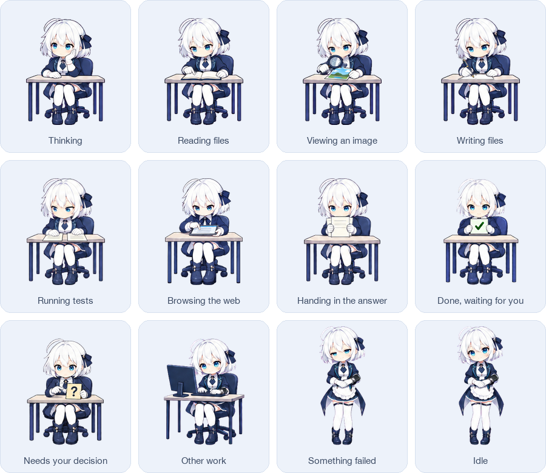
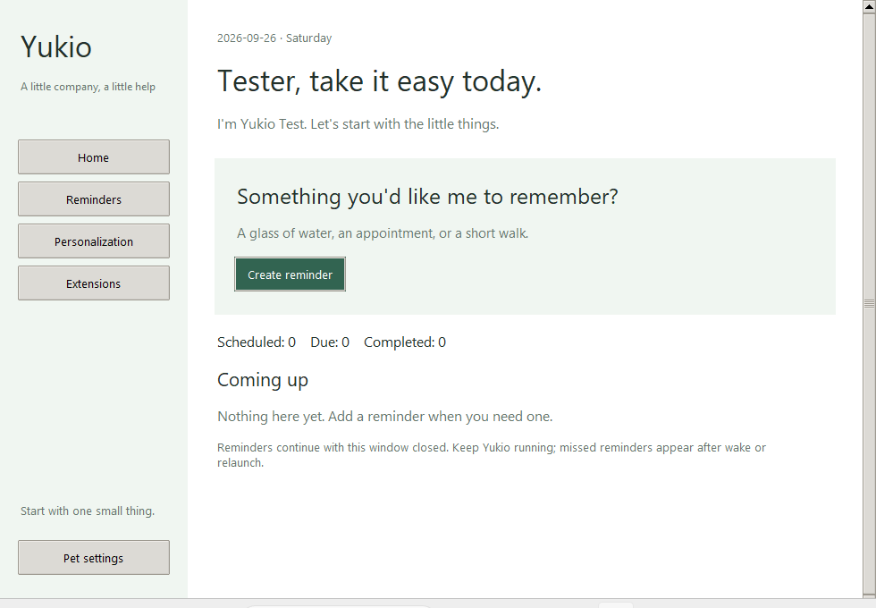

<div align="center">

**English** · [简体中文](README.zh-CN.md)

<h1>Yukio · the desktop pet that works alongside your coding agent</h1>



<p>
<a href="https://github.com/leozhang8654/yukio-desktop-pet/releases/latest"></a>
<a href="https://github.com/leozhang8654/yukio-desktop-pet/releases"></a>


</p>

</div>

**Yukio (雪绪)** is a white-haired, blue-eyed girl in a navy butler's uniform who sits in the corner of your screen and acts out what your AI coding agent is doing, as it happens. Claude Code reads a file, she opens a book. It edits, she picks up the pen. Tests run, she checks two sheets against each other. It finishes, and she holds up a ✅ card until you click her. That click drops you straight back into the chat that just finished.

She follows three families of agent, and you pick which one in her menu under **Assistant**: **Claude Code**, **DeepSeek's [Deep Code CLI](https://api-docs.deepseek.com/quick_start/agent_integrations/deepcode/)**, and **GPT's [Codex](https://developers.openai.com/codex/)** (the desktop app and the CLI both write the same session logs). The default, **Auto**, follows all three at once and shows whichever chat has something to say. Both builds use native windows and work entirely from local session logs.

## New in 0.3.0

- **A personal assistant on both platforms:** Home, Reminders, Personalization and Extensions, alongside the existing desktop pet.
- Create, edit or delete a one-time reminder; snooze for five minutes or mark it complete. Reminders are saved locally and catch up after wake or relaunch. Closing the main window keeps the app and reminder clock running.
- Customize the assistant name, your name and reminder sound. Open the assistant by right-clicking Yukio, from the tray/menu bar, or by launching the app again. Pet controls remain available from the sidebar and tray/menu bar.
- Codex async questions remain visible while other tools run and close when answered. Duplicate answers and outdated delivery results are ignored; automatic input stops if the clipboard or foreground app changes.
- Includes the stable head/neck, synchronized gaze, independent blinking and transparent-window fixes from 0.2.2.

AI conversations, screen observation, automatic activity records, news briefings and calendar connections are **planned, not active features**. See [assistant guide](docs/ASSISTANT.md) and [personalization design](docs/PERSONALIZATION.md).



[Full changelog](CHANGELOG.md)

## Download

Grab the file for your system from the [latest release](https://github.com/leozhang8654/yukio-desktop-pet/releases/latest). Nothing to compile, nothing else to install.

| You use | Download | Then |
| --- | --- | --- |
| macOS 13 or newer (Apple silicon and Intel) | [Yukio-0.3.0-macOS.zip](https://github.com/leozhang8654/yukio-desktop-pet/releases/download/v0.3.0/Yukio-0.3.0-macOS.zip) | Unzip, drag `Yukio.app` into Applications, allow it once (below) |
| Windows 10 / 11, 64-bit | [Yukio-0.3.0-Windows.exe](https://github.com/leozhang8654/yukio-desktop-pet/releases/download/v0.3.0/Yukio-0.3.0-Windows.exe) | Double-click. Python and the artwork are packed inside |

<details>
<summary><b>macOS says "Apple could not verify Yukio…"</b></summary>

The app carries only an ad-hoc signature and is not notarized (that needs a paid developer account), so Gatekeeper stops it once. You can inspect the source and verify the download checksum before opening it.

1. Double-click `Yukio.app` and click **Done** on the warning.
2. Open **System Settings › Privacy & Security**, scroll to **Security**, click **Open Anyway** next to the Yukio line, confirm, and enter your password.

If you trust this download, you can also remove its quarantine flag from Terminal:

```sh
xattr -dr com.apple.quarantine /Applications/Yukio.app
```

Builds you compile yourself are not quarantined and never show this.

</details>

<details>
<summary><b>Windows says "Windows protected your PC"</b></summary>

The exe is not code-signed. Click **More info**, then **Run anyway**. Only proceed if you trust the download.

</details>

The SHA-256 of every file is on the release page if you want to check a download.

Once running, Yukio appears in the bottom-right corner of the screen and a small avatar of her appears in the macOS menu bar or the Windows tray. The assistant window opens on launch. Right-click Yukio or launch the app again to reopen it; use the sidebar for pet settings, or the menu-bar/tray avatar for the full pet menu. Pet settings let you hide Yukio and bring her back; on macOS, Space in pet settings also toggles visibility. Want a tour first? Pick **Play demo** from Settings or the menu and she walks through every state in 60 seconds. English is the default, 中文 is one click away in Settings, and the choice is remembered.

## What she does

- **Twelve states, one character.** Thinking, reading files, viewing an image, writing files, running tests, browsing the web, handing in the answer, the ✅ done card, the ❓ question card, other work, something failed, idle. The mapping from each agent's tools to a state is explicit and covered by tests (one set of rules for all three: shell commands are classified the same way whether they arrive as Claude's `Bash`, Deep Code's `bash`, or Codex's `exec`). Unknown work falls back to typing at the computer instead of guessing.
- **Micro-motions, not slideshows.** Every state is one approved base image that a generator brings to life in small, continuous moves: the pen travels along the line, the magnifier sweeps the photo, a finger scrolls the tablet, two hands take turns on the keyboard, eyes blink in the right skin tone. The desk and chair never shift by a pixel, and the generator checks that. The artwork uses a 50 fps timeline; the desktop player updates at 30 Hz.
- **She tells you when it is your turn.** After the final answer she holds up the ✅ card and keeps holding it until you click. `AskUserQuestion` raises the ❓ card instead. Click her and the Claude desktop app opens that exact chat through its own `claude://` link. If that chat is already in front of you, she skips the card altogether.
- **Answer without leaving your seat.** When the ❓ card goes up, the question itself is copied onto a card beside her, options and all. Click an option — or type your own answer — and Yukio brings that chat to the front and puts the answer in for you (macOS asks once for Accessibility permission; Windows needs none). If that app doesn't come to the front, she presses nothing at all and just leaves the answer on the clipboard.
- **A bubble over her head.** The session title on top, the current step below, taken from the task list when there is one and otherwise from the tool: "Edit main.swift", "$ swift test", "developer.apple.com". A progress count and a thin bar sit beside it. Only file names, the first words of a command, and domains ever appear.
- **Several chats at once.** She can only act out one chat, so she picks the one that needs you: waiting for your answer, then stopped on an error, then done and holding a card, then whatever is still running. Every other chat becomes a small card stacked on top of the bubble. Click the bubble to fan them out, click a card to switch to that chat, or pin one chat from the menu.
- **Pick her up.** Drag her and she dangles from an invisible hand like a kitten held by the scruff: a damped pendulum with inertia, air drag, and a little sag when you yank upward. Let go and she settles in about a second.
- **Private by design.** She only reads the session logs the agents already write to disk, read-only. No network requests and no changes to agent settings. Task titles and pending questions appear locally; answering a question uses the clipboard and foreground app controls.
- **Paged artwork, bounded memory.** Release builds render from small, pixel-identical pages derived from the original lossless atlases. The page cache is capped at 32 MiB on macOS and 64 MiB on Windows instead of expanding the roughly 1 GB full atlas set at once. The macOS app still has no third-party runtime dependencies.

## A day at the desk

<table>
<tr>
<td></td>
<td>

Thinking → reading the code → checking a screenshot → editing → tests fail → fixing → tests pass → tidying the report → ✅.

These are the actual motion strips the app plays, exported at a slightly lower frame rate to keep the file small. Right after the answer she straightens the stack of papers, taps it twice on the desk, and only then raises the card.

</td>
</tr>
</table>

## The bubble and the card stack


Left: normally there is just the bubble and a thin "5 more" hint. Right: fanned out, with the most urgent chat closest to the bubble. Orange is waiting for you, red stopped on an error, green finished, blue still running. The ✕ dismisses one card until that chat does something new. Cards fold back after 12 seconds on their own.

## Picking her up


Straight out of the app's own swing model, with the camera following her so you see the tilt rather than the travel. Dragged sideways she lags behind the hand and swings past centre when it stops. Let go and she settles in about a second. A sharp lift makes her sag and spring back. The hand is invisible: the grip is a point just above her head, and the pendulum length is measured from the artwork itself, so a larger Yukio swings less.

## How she knows

**Where she reads from.** Claude Code writes a transcript for every session under `~/.claude/projects`; Codex writes one per chat under `~/.codex/sessions/<year>/<month>/<day>/rollout-*.jsonl`; Deep Code keeps its sessions under `~/.deepcode/projects`. Yukio tails whichever of those you picked, read-only, and turns tool calls into states. A tool call shows up about 0.2 seconds after it starts, then a 0.4 second debounce keeps her from twitching between quick calls. Claude Code's official hooks can be wired in as a second source; the script and settings snippet are in `YukioPlayer/integrations/claude-hooks/`, and enabling them is your call.

**Windows.** The same three families, at `%USERPROFILE%\.deepcode\projects`, `%USERPROFILE%\.claude\projects`, and `%USERPROFILE%\.codex\sessions`; for Deep Code she also reads the session index, which is the only place "waiting for your approval" is written. Point Claude Code at DeepSeek's Anthropic-compatible endpoint and its transcripts are followed the same way. Any other tool can drive her by appending JSON lines to `%LOCALAPPDATA%\Yukio\inbox.jsonl`.

These logs are internal to those tools, not public APIs. If a format changes she shows fewer events and drifts back to idle instead of crashing.

## Build from source

**macOS** needs only the Xcode Command Line Tools to build and run. Making the official low-memory release zip also uses Python and Pillow once at build time to derive pixel-identical artwork pages; the packaged app itself has no Python dependency.

```sh
git clone https://github.com/leozhang8654/yukio-desktop-pet
cd yukio-desktop-pet/YukioPlayer
swift test                      # 157 tests: routing, blink timing, classification, parsers, bubble text, timelines, chat picking, questions
./scripts/build-app.sh          # build/Yukio.app
open build/Yukio.app
cd ../YukioWin && pip3 install pillow && python3 scripts/prepare-windows-assets.py
cd ../YukioPlayer && ./scripts/package-release.sh  # universal binary zip in dist/
```

**Windows** needs Python 3.9 or newer.

```bat
cd yukio-desktop-pet\YukioWin
pip install pillow
python run.py
python run.py --selftest                                          # 198 tests, runs on any OS
powershell -ExecutionPolicy Bypass -File scripts\build-exe.ps1    # dist\Yukio.exe, artwork included
```

No Windows machine? The GitHub Actions workflow builds the exe on a real Windows runner and smoke-tests it there: it launches the exe, finds her windows, checks the pose against a staged Deep Code session, and compares screenshots pixel by pixel at 100% and 150% scaling.

Both players have window-less modes for poking around: `--demo`, `--replay session.jsonl`, `--watch 60`, `--chats`, `--snapshot`, `--bubble`, `--cards`, `--hang`. See the two player READMEs for the full list.

## Repository map

| Path | What is in it |
| --- | --- |
| `YukioPlayer/` | macOS player: Swift sources and tests, bundled artwork and app icon, the motion, icon, and drag-pose generators under `tools/`, build and release scripts. [README](YukioPlayer/README.md) |
| `YukioWin/` | Windows player: Python and ctypes layered window, tests, PyInstaller spec, the smoke test CI runs. [README](YukioWin/README.md) |
| `assets/` | Final transparent artwork: the seven activity strips, the desk, the two cards, the base poses |
| `sources/` | High-resolution generation sources, magenta-keyed |
| `references/` | Contact sheet, generation prompts, image inventory |
| `docs/readme/` | The images on this page, and `make_images.py` to regenerate them |
| [`docs/HANDOFF.md`](docs/HANDOFF.md) | Design log: requirements, feedback, and changes (Chinese) |
| [`docs/history/`](docs/history/README.md) | Original hand-off bundle and early native pet snapshot |
| [`sources/approved-animation-rig/`](sources/approved-animation-rig/README.md) | Reviewed artwork, component masks and reproducible animation inputs |

## Good to know

- English by default. Open the assistant, then Pet settings, where Language can be switched to 中文; the choice is remembered. Descriptions already attached to earlier events keep their language until the next event arrives. The command-line check modes still print their diagnostics in Chinese.
- The current animations use reviewed 384×416 artwork directly (384×480 for the picked-up pose), displayed at 192×208 points by default. The production workflow preserves these 2x sources without another upscaling pass. The old thick, blurry dark fringe from keying is gone; a thin half-point outline is drawn around her instead. She stays crisp on Retina and HiDPI screens; above 200% she starts to soften again.
- Click-to-jump needs a desktop app: the Claude app for Claude Code chats, the Codex app for Codex chats (`codex://threads/<id>`). An agent run in a terminal has no chat window to open, so a click only brings that app to the front. Deep Code chats live in the terminal, so there a click simply lowers the card. Verified on macOS; the Windows path is written the same way but has not been tried on a real machine yet.
- Size is a 50 to 200% slider in pet settings on both platforms; Windows also keeps fixed steps and ±5% nudges in the tray menu.
- The macOS app is ad-hoc signed and not notarized; the Windows exe is unsigned. Building from source avoids the first-launch prompts.

## How the art is made

Each state uses approved artwork and corrected SAM 2.1 component masks. The head and neck stay fixed, while hands, attached props, reading gaze and independent eyelids retain their reviewed animation. The production generator reuses the existing 2x sources directly; see [animation inputs and workflow](sources/approved-animation-rig/README.md).

If Yukio makes your day at the keyboard a little nicer, a ⭐ helps other people find her.
