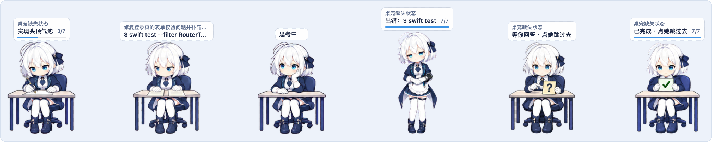
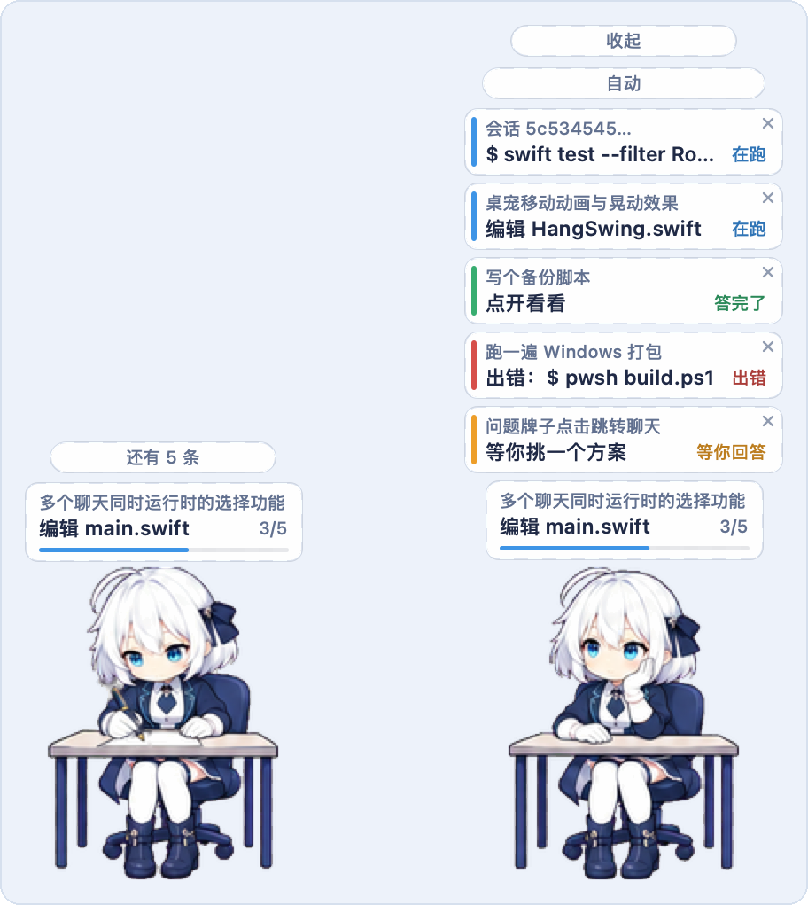

<div align="center">

[English](README.md) · **简体中文**

<h1>雪绪 · 陪着编码助手干活的桌面宠物</h1>


<p>
<a href="https://github.com/leozhang8654/yukio-desktop-pet/releases/latest"></a>
<a href="https://github.com/leozhang8654/yukio-desktop-pet/releases"></a>


</p>

</div>

**雪绪**是个白发蓝眼的管家少女，待在屏幕角落，实时演着你的 AI 编码助手正在做的事：Claude Code 读文件，她翻开书；改代码，她提起笔；跑测试，她对着两份文件逐行核对；答完了，她举起 ✅ 牌一直等你。点她一下，直接跳回刚答完的那条聊天。

她认三家助手，在菜单「跟随的助手」里挑：**Claude Code**、**DeepSeek 的 [Deep Code CLI](https://api-docs.deepseek.com/quick_start/agent_integrations/deepcode/)**、**GPT 的 [Codex](https://developers.openai.com/codex/)**（桌面版与命令行写的是同一份会话记录）。默认的**自动**三家一起跟，谁有话说就显示谁。两版都是原生实现，体积很小，完全不联网。

## 下载（不用编译）

到 [Releases](https://github.com/leozhang8654/yukio-desktop-pet/releases/latest) 下载对应的那个，不用装别的东西。

| 你用的是 | 下载 | 怎么开 |
| --- | --- | --- |
| macOS 13 或更新（Apple 芯片与 Intel 通用） | `Yukio-0.2.0-macOS.zip` | 解压，把 `Yukio.app` 拖进「应用程序」，第一次按下面放行一次 |
| Windows 10 / 11（64 位） | `Yukio-0.2.0-Windows.exe` | 双击就开。Python 和素材都打包在里面 |

<details>
<summary><b>macOS 第一次打开：「Apple 无法验证“Yukio”是否包含可能危害 Mac 安全或泄漏隐私的恶意软件」</b></summary>

这是因为它只有本机临时签名、没有做苹果公证（需要付费的开发者账号），不是因为它做了什么。放行一次，以后正常双击：

1. 双击 `Yukio.app`，在提示框上点「完成」；
2. 打开「系统设置 › 隐私与安全性」，往下滚到「安全性」一栏，在“已阻止使用「Yukio」…”那行右边点**「仍要打开」**，在弹窗里再点一次并输入密码。

macOS 15 起，右键→「打开」这个老办法已经绕不过 Gatekeeper，只能走系统设置。用终端也可以一行解决：

```sh
xattr -dr com.apple.quarantine /Applications/Yukio.app
```

自己从源码编译出来的 `Yukio.app` 不带隔离标记，不会有这个提示。

</details>

<details>
<summary><b>Windows 第一次打开：蓝色的「Windows 已保护你的电脑」</b></summary>

这个程序没有买代码签名证书。点**「更多信息」**，再点**「仍要运行」**，以后不再问。

</details>

每个文件的 SHA-256 都写在发布页上，想核对的话对一下。

打开后雪绪出现在屏幕右下角，macOS 的菜单栏、Windows 的托盘里多一个她的小头像。在 macOS 上，右键雪绪会直接打开设置；点菜单栏小头像或再打开一次应用可进入完整菜单。设置里有「收起雪绪」按钮，设置窗口开着时直接按空格也行，再按一下把她叫回来。界面默认英文，在设置里把「Language」切到「中文」即可，选择会记住。想先看看效果，可在设置或菜单里点「播放模拟演示」（英文界面下是 Play demo），60 秒走一遍所有动作。

## 她会做什么

- **十二种状态，同一只她。** 思考、读文件、看图片、写文件、跑测试、看网页、递交回答、✅ 勾选卡、❓ 问号卡、其他工作、出错、空闲。每家助手的工具对应哪个状态都写得清清楚楚，逐条有测试；三家共用同一套规则（同一条 shell 命令，不管是 Claude 的 `Bash`、Deep Code 的 `bash` 还是 Codex 的 `exec`，判出来一样）；认不出的工作一律坐在电脑前敲键盘，不瞎猜。
- **小幅、连续、不抽搐。** 每个状态只有一张定稿的底图，动作由脚本生成：笔沿着一行往右写，放大镜在照片上来回扫，手指在平板上往上划，两只手轮流敲键盘，眨眼时眼皮用的是脸颊的肤色。桌椅逐像素不动，生成时会自动检查。每秒 20 到 30 帧。
- **轮到你的时候她会举牌。** 答完先递交报告，然后举起 ✅ 牌，一直举到你点她为止；`AskUserQuestion` 等你拿主意时立起 ❓ 牌。点她一下，桌面版 Claude 就用它自己的 `claude://` 深链打开那条聊天。那条聊天要是已经开在你眼前，她干脆不举。
- **头顶一个小气泡。** 上行是聊天标题，下行是当前这一步：有任务清单时取进行中的那一项，没有就取正在跑的工具，“编辑 main.swift”“$ swift test”“developer.apple.com”。旁边是已完成／总数和一条细进度条。气泡里只出现文件名、命令的前几个词和网址域名。
- **几条聊天一起跑也不乱。** 她一次只能演一条，所以先演最需要你的那条：等你回答的，然后是出错停住的，然后是答完举着牌的，最后才是还在干活的。其余每条聊天各一张小卡，压着气泡往上叠。点气泡摊开，点一张就换到那条聊天，也可以在菜单里挑定一条只跟它。
- **拎起来会晃。** 按住她拖，她像被一只看不见的大手捏着后领的小猫：单摆带惯性，匀速时略微后仰，猛地往上一提会先坠一下再弹回来。松手大约一秒晃停。
- **只读、不联网、不留对话。** 她只看这些工具本来就写在本机的会话记录，只读不写。不联网，不改任何工具的设置，不保存也不显示对话内容。
- **分页加载，内存有上限。** 正式包保留无损原图集保证素材完整，但运行时读取逐像素一致的小分页；macOS 页缓存上限 32 MiB，Windows 上限 64 MiB，不再一次性展开约 1 GB 的整套图集。macOS 运行时仍然没有第三方依赖。

## 桌前的一天

<table>
<tr>
<td></td>
<td>

思考 → 读代码 → 拿放大镜看截图 → 改文件 → 测试没过 → 修 → 测试通过 → 整理报告 → ✅。

这就是应用里实际播放的那几条动作图条，导出时稍微降了一点帧率好让文件小一些。答完之后她会先把手里那叠纸在桌上磕两下对齐，然后才举牌。

</td>
</tr>
</table>

## 头顶气泡与那摞卡





上面两张是切成中文之后的样子。左边是平时：气泡上面只多一条细细的“还有 5 条”。右边是摊开之后，最要紧的那张挨着气泡。橙色是等你回答，红色是出错停住，绿色是答完了，蓝色是还在跑。✕ 只收起那一张，那条聊天下一轮有动静时会再出现；12 秒没人点会自己收起。

## 拎起来


直接用应用里那套摆动模型录的，镜头跟着她走，所以看到的是倾斜和下坠，不是位移。往旁边拖，她因为惯性落在手后面，手一停她还要荡过竖直线再收住；松手大约一秒晃停；猛地往上一提，先坠一下再弹回来。那只手是看不见的：抓手点在她头顶上方一点，摆长直接从图上量出来，所以放大之后同样的甩动摆得更小。

## 她是怎么知道的

**她读哪里。** Claude Code 把每条会话写在 `~/.claude/projects`；Codex 一条聊天一个文件，在 `~/.codex/sessions/<年>/<月>/<日>/rollout-*.jsonl`；Deep Code 在 `~/.deepcode/projects`。雪绪只读地跟着你挑的那一家，把工具调用翻译成状态。工具开始后大约 0.2 秒她就看到了，再加 0.4 秒防抖，免得连续的短调用把她晃来晃去。Claude Code 的官方 hooks 可以接成第二来源，脚本和设置片段在 `YukioPlayer/integrations/claude-hooks/`，开不开由你决定。

**Windows。** 同样是这三家：`%USERPROFILE%\.deepcode\projects`、`%USERPROFILE%\.claude\projects`、`%USERPROFILE%\.codex\sessions`；Deep Code 那边还要读会话索引——「等你批准」只写在索引里。把 Claude Code 指向 DeepSeek 的 Anthropic 兼容端点时，它写出来的转录照样跟得上。别的工具也能驱动她：往 `%LOCALAPPDATA%\Yukio\inbox.jsonl` 里追加一行 JSON 就行。

这些记录是各家工具的内部格式，不是公开 API。格式变了她只会少几个事件、慢慢回到空闲，不会崩。

## 自己编译

**macOS** 编译运行只需要 Xcode Command Line Tools。制作官方低内存发布包时，还会在构建阶段用一次 Python 与 Pillow 派生逐像素一致的分页；打好的 App 本身不依赖 Python。

```sh
git clone https://github.com/leozhang8654/yukio-desktop-pet
cd yukio-desktop-pet/YukioPlayer
swift test                      # 127 个测试：路由、眨眼时序、分类、解析、气泡文字、动作时间线、聊天选择
./scripts/build-app.sh          # 生成 build/Yukio.app
open build/Yukio.app
cd ../YukioWin && pip3 install pillow && python3 scripts/prepare-windows-assets.py
cd ../YukioPlayer && ./scripts/package-release.sh  # 打通用二进制发布包到 dist/
```

**Windows** 需要 Python 3.9 或更新。

```bat
cd yukio-desktop-pet\YukioWin
pip install pillow
python run.py
python run.py --selftest                                          # 141 个测试，任何系统上都能跑
powershell -ExecutionPolicy Bypass -File scripts\build-exe.ps1    # 打出 dist\Yukio.exe，素材已包含
```

手边没有 Windows？仓库里的 GitHub Actions 工作流会在真的 Windows 机器上打出 exe 并实跑一遍：启动它、枚举出她的窗口、按一份造好的 Deep Code 会话核对动作，再在 100% 和 150% 两种缩放下截屏逐像素比对。

两个播放器都有不开窗口的检查模式：`--demo`、`--replay 会话.jsonl`、`--watch 60`、`--chats`、`--snapshot`、`--bubble`、`--cards`、`--hang`。完整列表见两个播放器各自的 README。

## 目录

| 路径 | 内容 |
| --- | --- |
| `YukioPlayer/` | macOS 播放器：Swift 源码与测试、打包进应用的素材与图标、`tools/` 下的动作／图标／拎起姿势生成脚本、构建与发布脚本。[README](YukioPlayer/README.md) |
| `YukioWin/` | Windows 播放器：Python + ctypes 分层窗口、测试、PyInstaller 配置、CI 用的冒烟测试。[README](YukioWin/README.md) |
| `assets/` | 最终透明素材：七套活动图条、电脑桌、两张牌子、基础动作 |
| `sources/` | 高分辨率生成源图（洋红底） |
| `references/` | 动作总览、生成提示词、图片清单 |
| `docs/readme/` | 本页用到的图，以及重新生成它们的 `make_images.py` |
| `HANDOFF.md` | 设计记录：需求、用户反馈、什么时候改了什么 |
| `START_HERE.md`、`PLAYER_REQUIREMENTS.md`、`CONTINUE_PROMPT.txt`、`native-current/`、`preview.html` | 最初的接续包，留作历史 |

## 先说清楚的几件事

- 界面默认英文，右键雪绪打开设置后，可在「Language」中切换中文，选择会记住。已经写进事件里的说明文字（比如“阅读 main.swift”）要到下一条事件才换语言。
- 素材按 192×208 画和做动作，发出去的是 2 倍图条（384×416，被拎起来那张 384×480），用动画专用的超分模型放大。原来抠图留下的那圈又粗又糊的黑边去掉了，换成轮廓外一圈 0.5 点的细描边。Retina／高分屏上放大也是清楚的；超过 200% 才会重新变软。
- 点一下跳回聊天需要对应的桌面版：Claude 的聊天要桌面版 Claude，Codex 的聊天要 Codex 桌面版（`codex://threads/<会话 ID>`）。在终端里跑的助手没有聊天窗口可开，点了只把那个应用带到最前面；Deep Code 的聊天在终端里，点一下只是放下牌子。这套跳转在 macOS 上实测过，Windows 那边照同一套写的，还没在实机上验过。
- 大小：macOS 是 50%–200% 的滑条，Windows 是七个整档加 ±5%，因为 Win32 的原生菜单塞不进滑条。
- 安装包没有签名、没有公证。从源码自己编译就不会有第一次打开的那些提示。

## 素材是怎么来的

人物由 ChatGPT 的图像模型按同一套参考图生成，再由 `YukioPlayer/tools/` 里的 Python 脚本抠图、裁切、做成动作。动画有意不逐帧生成：每个状态只有一张定稿底图；手、笔、放大镜、纸这类要明显移动的部件抠成单独一层，平移旋转 2 到 5 像素，原位置补齐；头和眼睛用局部小幅变形；每一帧都会检查桌腿是否纹丝不动。做好的帧再用 Real-ESRGAN 的动画模型超分成 2 倍、描一圈细细的深色轮廓；1 倍时不动的地方，2 倍各帧也逐像素一致。

如果雪绪让你敲键盘的日子好过了一点，点个 ⭐ 能让更多人找到她。
