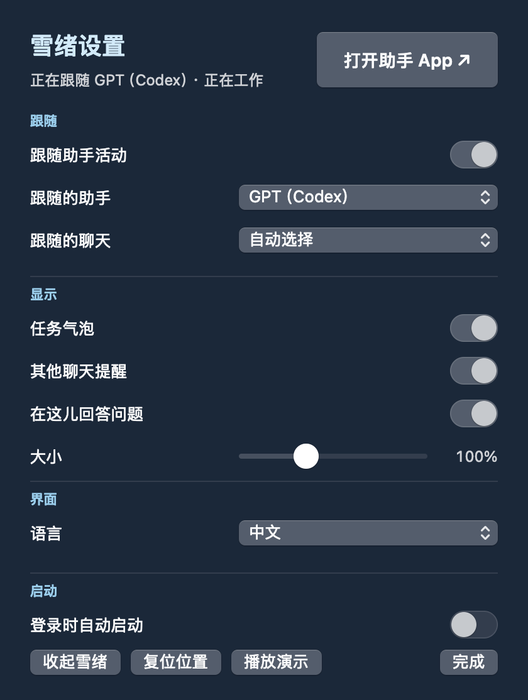
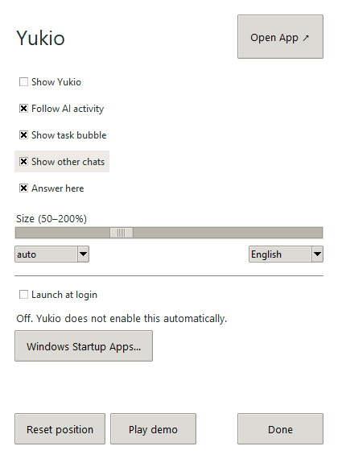

# 登录时自动启动（macOS / Windows）

打开桌宠设置，在“启动”区域切换“登录时自动启动”。开启后，登录当前 macOS 用户时自动打开雪绪；关闭后不再自动启动。首次添加功能不会替用户开启，已有系统设置会保留。

开关读取 macOS 登录项的实际状态，没有另存一份容易失步的布尔偏好。若系统要求批准，会显示提示和“打开系统登录项…”按钮；若修改失败，会显示错误并恢复系统实际状态。

使用 Apple 的 [`SMAppService.mainApp`](https://developer.apple.com/documentation/servicemanagement/smappservice/mainapp) 管理主 App 登录项，不添加 LaunchAgent 或额外后台程序。实现位于 `YukioPlayer/Sources/YukioPlayer/LaunchAtLogin.swift`，设置入口位于 `SettingsPanel.swift`。

验证覆盖开启、关闭、重复点击、待批准时取消、系统外部变更，以及注册/注销失败时不显示虚假成功。命令：

```sh
swift test --package-path YukioPlayer --filter LaunchAtLoginTests
```

登录项的真实开关需在安装好的 `.app` 中验证。编译生成的裸命令行程序不代表已安装 App 的注册状态。

## Windows

右键雪绪，在小设置窗口勾选「登录时自动启动」。默认关闭，打开设置不会自动注册。也可以由助手侧边栏进入小设置。

通过当前用户的 `HKCU\Software\Microsoft\Windows\CurrentVersion\Run` 注册 Yukio 的完整程序路径；无需管理员权限。关闭开关只删除 Yukio 自己的启动项。依据 [Microsoft Run 键说明](https://learn.microsoft.com/en-us/windows/win32/setupapi/run-and-runonce-registry-keys)，Windows 可能延迟启动，它不是定时闹钟服务。

如果 Windows 在启动应用设置中禁用了此项，会提示去系统设置确认；应用不会擅自改写系统批准状态。将 EXE 移动到其他位置或下载新版本后，需重新开启一次以更新路径。路径过长或注册失败会报错，不显示虚假成功。推荐将程序放到固定文件夹使用。

Windows 自动测试会用独立的临时启动项验证实际注册和移除，最后清理；macOS 的系统注册接口使用注入测试。真实注销／重新登录和全屏 App 的覆盖显示仍需要在用户环境验证。

## 设置窗口




